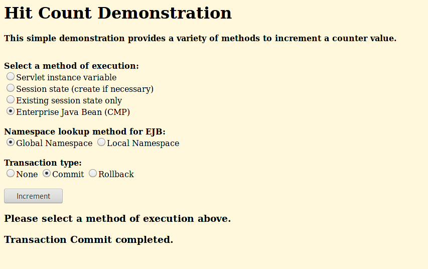

= Deploying a WebSphere Application Using OpenShift Pipelines

== Introduction

OpenShift Pipelines is a cloud-native, continuous integration and continuous delivery (CI/CD) solution based on Kubernetes resources. It uses Tekton building blocks to automate deployments across multiple platforms by abstracting away the underlying implementation details. Every task runs as a pod, and each step runs as a container within that pod. You can use OpenShift pipelines to deploy your WebSphere apps. TA generates a basic pipeline that you can use as a starting point.

== Steps

In this section, we will be walking you through the deployment of an OpenShift Pipeline that we will use to deploy your WebSphere application.

=== Install the Pipeline Operator

The first step is to deploy the OpenShift Pipeline Operator from the OperatorHub.

In the side menu, click on `Operators` and select `OperatorHub`. Search for `OpenShift Pipelines`.


Install the OpenShift Pipeline Operator using the default settings.

image::./Images/PipelinesOperatorInstall.png[image]

=== Clone the Repository

Open a terminal and run the following command to clone the necessary repository:

```
git clone https://github.com/jnovotni/TA-klp-demo
```

Then, change directory to the newly cloned repository by running the following command:

```
cd TA-klp-demo
```

=== Pipeline Resources

The IBM Transformation Advisor automatically generates the necessary yaml definitions for creating an OpenShift Pipeline that can deploy our WebSphere application.


`00-apply-manifest-task.yaml` and `00-update-deployment_task.yaml` are custom tasks used by the pipeline.

`01-pipeline.yaml` is the definition for the pipeline itself.

`pv-claim.yaml` will create the persistent volume claim for a volume that the pipeline uses for persistent storage between tasks.

`03-pipeline-run.yaml` specifies the resources that the pipeline will use. This file has been modified to use my repo and image. Creating this resource will cause the pipeline to run and build our application.

=== Run the Pipeline

Now that we have installed the operator and cloned the repository, we need to create our pipeline.

The first thing we need to do is create a project for our pipeline. If you haven't already, login to your cluster from the terminal.

Run the following command to create a project called `websphere-pipeline`.

```
oc new-project websphere-pipeline
```

Now we will create the pipeline resources.

Run the following command to create all of the necessary resources and run the pipeline.

```
oc create -f pipeline/openshift/
```

The process will take a couple of minutes. You can view the pipeline's status in the OpenShift UI.


The pipeline will clone the application's repo, build the application, apply manifests, and update the image.

To see more detailed information about what's going on, select the `Logs` tab.


After a few minutes the pipeline run will complete and our application will be deployed.


=== Access and Test the Application

Once the deployment is complete, we can access the application by using its route.

On the side menu, click on `Networking` and select `Routes`. You should see the route for the application that we just deployed. Under `Location`, you will see the application's URL.


Take the URL and add `/hitcount` to the end of it so that we hit our Hit Count application's end point. Paste this into your browser to access the application.

For example `http://defaultapplication-websphere-pipelines.apps.ocp.shadowman.dev/hitcount`

Select `Enterprise Java Bean (CMP)` as the method of execution, `Global Namespace` as the lookup method, and `Commit` as the transaction type. Click `Increment`.



You will see a message indicating that the count has been incremented.

image::./Images/IncrementedCount.png[image]

== Review

In this section we were able to create an OpenShift Pipeline to deploy our application using the files generated by IBM's Transformation Advisor.

== Sections

<<Introduction.adoc#, Back to the Introduction>>

<<JBossRehost.adoc#, Rehosting a JBoss Application>>

<<WebSphereRehost.adoc#, Rehosting a WebSphere Application>>

<<WebLogicRehost.adoc#, Rehosting a WebLogic Application>>

<<OpenShiftPipelines.adoc#, Deploying a WebSphere Application Using OCP Pipelines>>
