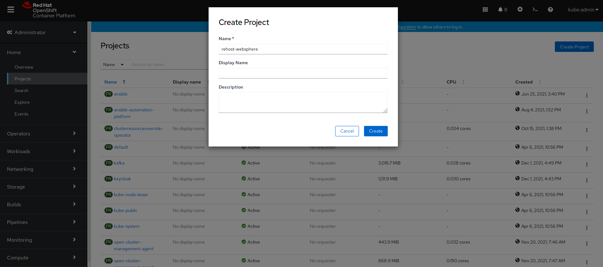
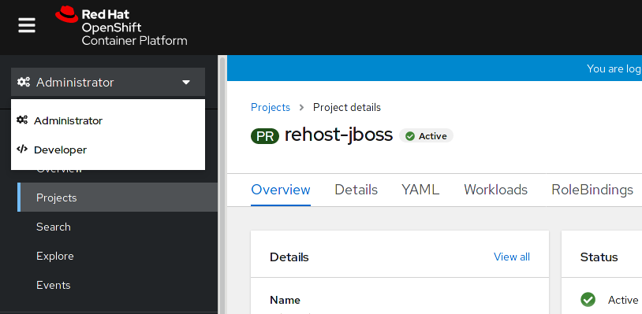
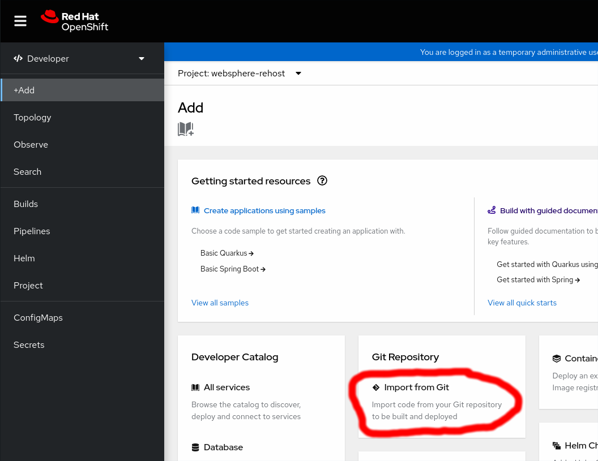
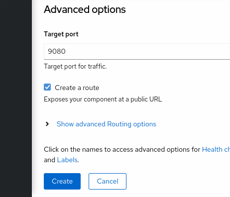
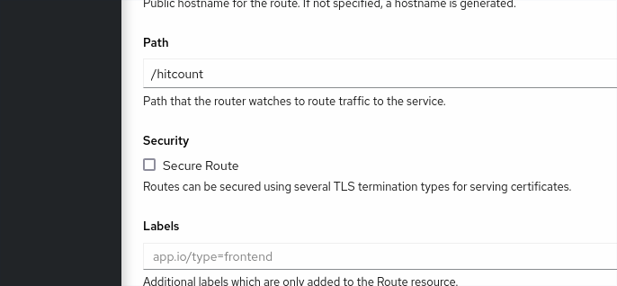
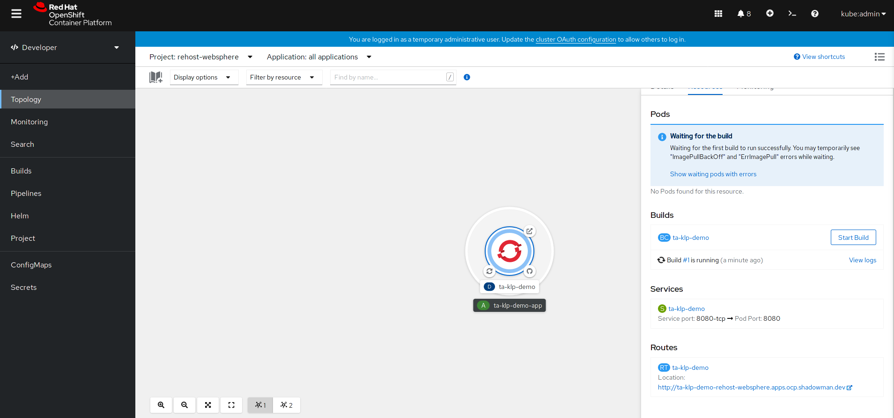
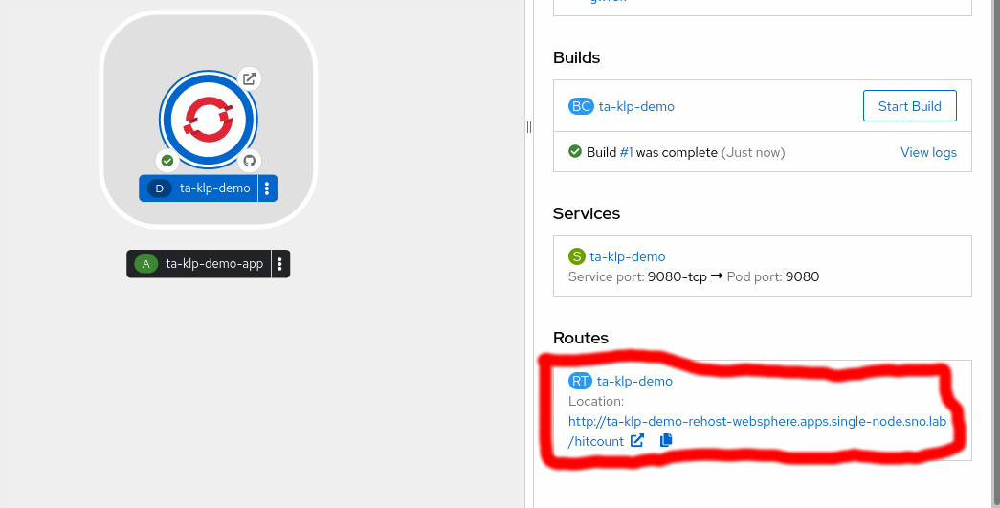
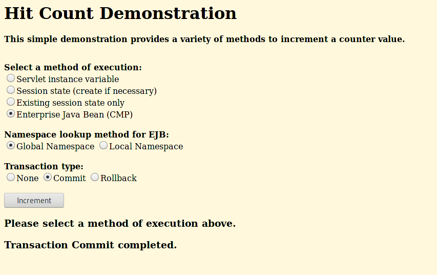
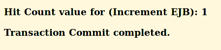

= Rehosting a WebSphere Application

== Introduction

IBM WebSphere Application Server accelerates application delivery with a highly reliable Java Enterprise Edition-based runtime environment. It supports microservices and standards-based programming models designed to help you modernize at your own pace, gain visibility across workloads, analyze enterprise applications and advance your journey to Kubernetes.

== Steps

In this section, we will be walking you through the deployment of an existing WebSphere application onto OpenShift without making any modifications to the code.

=== Create Project

Go to the `Projects` tab and click on `Create Project` in the top right corner. Name the project `rehost-websphere` and click `Create`.

=== Deploy Application

We are going to switch to Developer perspective for the remainder of this section. If you are not already in the Developer perspective, switch over now.

Click `+Add` in the upper left corner and select `Import from Git`.

Enter the GitHub Repo URL `https://github.com/jnovotni/TA-klp-demo`. The fields will be auto-populated.

Scroll down to `Advanced options`.

Enter `9080` for the `Target port` and make sure that `Create a route` is checked.

Click on `Show advanced Routing options`. This will give us more options.

Enter `/hitcount` for `Path` and uncheck the `Secure Route` option under `Security`.

Click `Create`.

We can watch the application deployment in the `Topology` tab. The deployment will take a couple of minutes. We can click the icon to see more information about the deployment.

=== Access and Test the Application

Once the deployment is complete, we can access the application by clicking the URL under the Routes section of the Deployment information.

Select `Enterprise Java Bean (CMP)` as the method of execution, `Global Namespace` as the lookup method, and `Commit` as the transaction type. Click `Increment`.

You will see a message indicating that the count has been incremented.

== Review

As you saw, when we say "no code changes" we mean **no code changes**. We were able to containerize our WebSphere application and deploy it onto OpenShift without ever editing a line of code.

== Sections

<<Introduction.adoc#, Back to the Introduction>>

<<JBossRehost.adoc#, Rehosting a JBoss Application>>

<<WebLogicRehost.adoc#, Rehosting a WebLogic Application>>

<<OpenShiftPipelines.adoc#, Deploying a WebSphere Application Using OCP Pipelines>>
